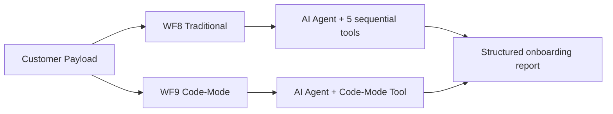

# POC-01: Customer Onboarding Pipeline

## Overview

This POC compares a traditional multi-tool AI workflow against a code-mode version that executes the same customer onboarding logic inside one sandboxed TypeScript run. It is the benchmark case for the core runtime claim: fewer LLM round-trips, fewer nodes, and lower latency without changing the business task.

**Trigger:** n8n API execution (benchmark workflows WF8/WF9)  
**Nodes:** WF8 `22`, WF9 `3`  
**LLM:** Gemini 2.0 Flash (via Google AI)  
**Workflows:** `zQ4KCniPiiOS3EEG` (WF8), `WVeyUVbK32wI6ZGQ` (WF9)

## Flow



## Nodes

| Node | Type | Purpose |
|---|---|---|
| Customer Payload | Input | Supplies customer data such as name, email, and company |
| AI Agent (WF8) | AI Agent | Orchestrates the traditional step-by-step tool chain |
| 5 sequential tools (WF8) | Tool sub-nodes | Validate email, classify company, score tier, generate message, and format the report |
| AI Agent (WF9) | AI Agent | Invokes code-mode for the same task |
| Code-Mode Tool (WF9) | Tool sub-node | Executes the full onboarding pipeline inside one TypeScript block |

## Test

<!-- TODO: replace the placeholder webhook path with the real deployed endpoint -->
```bash
curl -X POST http://<n8n-host>/webhook/<workflow-endpoint> \
  -H "Content-Type: application/json" \
  -d '{"name":"Maria Schmidt","email":"maria.schmidt@microsoft.com","company":"Microsoft Deutschland GmbH"}'
```

Expected output: a structured onboarding result containing email validation, company classification, customer tier, personalized message, and final report.

## Benchmark

| Metric | Traditional (WF8) | Code-Mode (WF9) | Savings |
|---|---|---|---|
| LLM calls | 11 | 1 | **91%** |
| Tokens | ~18,000 | ~700 | **96%** |
| Latency | 12.5s | 2.5s | **80%** |
| Nodes | 22 | 3 | **86%** |

See [playbook/benchmarks.md](../../playbook/benchmarks.md) for full methodology and data.

## Install

```bash
# n8nac push
# TODO: export WF8 and WF9 as workflow.ts files, then replace these placeholders.
npx n8nac push <path-to-wf8-workflow.ts>
npx n8nac push <path-to-wf9-workflow.ts>
```

```bash
# Import via JSON
# TODO: export WF8 and WF9 from n8n, then document the JSON import steps here.
```

## What This Proves

**Lifecycle layer:** Runtime execution  
**Thesis claim:** Code-mode collapses N sequential LLM tool calls into 1 sandboxed execution

## Status

- [x] Traditional workflow built and benchmarked (WF8)
- [x] Code-mode workflow built and benchmarked (WF9)
- [x] Results documented
- [ ] `workflow.ts` — n8nac-compatible workflow definition (TODO: export from n8n)
- [ ] `test.json` — automated test harness (TODO: code-mode test execution)
- [ ] Reproducible from terminal (TODO: n8nac push + test cycle)
