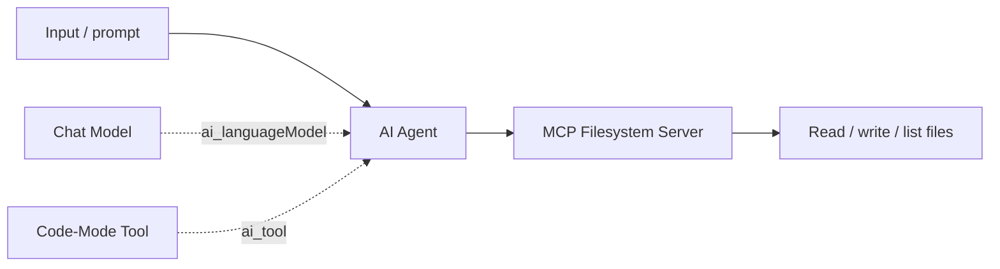

# POC-02: MCP Filesystem Integration

## Overview

This POC proves that code-mode can bridge from sandboxed TypeScript into a real MCP filesystem server and perform actual file operations, not mocked tool calls. It extends the runtime thesis from synthetic tools to external system integration through MCP over stdio.

**Trigger:** TBD <!-- TODO: document the deployed WF10 invocation method or webhook path -->  
**Nodes:** TBD <!-- TODO: document the exact WF10 node count -->  
**LLM:** Claude via OpenRouter (recommended); GPT-4o also works; Gemini 2.0 Flash is unreliable  
**Workflow:** `Ml4GL2HRJCSpCXtM` (WF10)

## Flow



## Nodes

| Node | Type | Purpose |
|---|---|---|
| AI Agent | AI Agent | Coordinates the file task and invokes code-mode |
| Chat Model | LLM | Generates the TypeScript that chains filesystem operations |
| Code-Mode Tool | Tool sub-node | Executes the generated TypeScript inside the sandbox |
| MCP Filesystem Server | MCP server | Exposes real filesystem tools over stdio |

## Test

<!-- TODO: replace the placeholder endpoint with the real WF10 execution path -->
```bash
curl -X POST http://<n8n-host>/webhook/<wf10-endpoint> \
  -H "Content-Type: application/json" \
  -d '{"prompt":"List files in the allowed directory and read the first .json file"}'
```

Expected output: the agent lists files in the allowed directory and reads file contents through MCP-backed filesystem tools inside one sandbox execution.

## Benchmark

| Metric | Direct MCP | Code-Mode via MCP bridge | Observation |
|---|---|---|---|
| Filesystem tools available | Filesystem server only | 14 tools available inside sandbox | Parity achieved |
| Per-tool latency | Baseline | Baseline + `10-50ms` | Acceptable bridge overhead |
| End-to-end file task | Manual MCP client code | One LLM-written TypeScript block | Working |

## Install

```bash
# n8nac push
# TODO: export WF10 as workflow.ts, then replace this placeholder.
npx n8nac push <path-to-wf10-workflow.ts>
```

```bash
# Import via JSON
# TODO: export WF10 from n8n, then document the JSON import steps here.
```

## What This Proves

- **Lifecycle layer:** Runtime + external tools
- **Thesis claim:** Code-mode executes real MCP tool operations inside the sandbox, extending beyond simulated tools to actual system integration

## Status

- [x] MCP filesystem server connected via stdio transport
- [x] 14 tools registered in code-mode sandbox
- [x] Claude successfully reads real files through sandbox
- [x] Results documented
- [ ] `workflow.ts` — n8nac-compatible workflow definition (TODO: export from n8n)
- [ ] `test.json` — automated test that verifies file read/write through sandbox
- [ ] Benchmark vs direct MCP calls (TODO: measure exact overhead)
