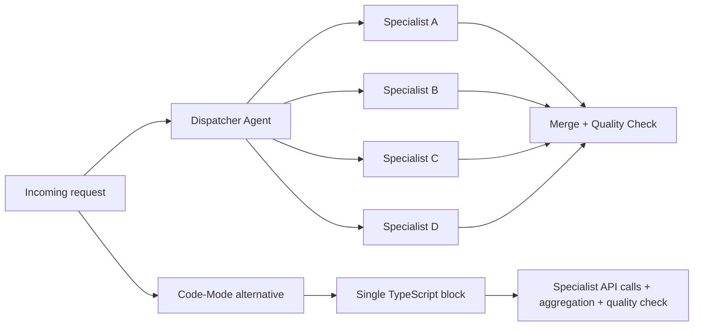

# POC-03: Multi-Agent Dispatch → 1 Code Block

## Overview

This POC documents the architectural reduction of a 16-node multi-agent dispatcher into a code-mode workflow that keeps the specialist calls but removes most orchestration plumbing. It is still design-only, but it frames how code-mode can replace switch, merge, and routing overhead with ordinary TypeScript control flow.

**Trigger:** TBD <!-- TODO: document the future workflow trigger or webhook path -->  
**Nodes:** Traditional `16`, code-mode target `3`  
**LLM:** Gemini specialist calls remain; orchestration model setup TBD <!-- TODO: document once implemented -->  
**Source workflow:** WF5 from `n8n-autopilot`

## Flow



## Nodes

| Node | Type | Purpose |
|---|---|---|
| Dispatcher Agent | AI Agent | Routes the request to the correct specialist paths in the traditional design |
| Specialist Agents | AI Agents | Perform the domain-specific sub-tasks |
| Merge + Quality Check | Merge / AI Agent | Aggregates specialist outputs and verifies quality |
| Code-Mode Tool | Tool sub-node | Planned replacement for the routing and merge logic |
| Single TypeScript block | Generated code | Planned orchestration layer for dispatch, aggregation, and return |

## Test

<!-- TODO: add a real curl command after the code-mode variant is implemented -->
```bash
curl -X POST http://<n8n-host>/webhook/<wf5-codemode-endpoint> \
  -H "Content-Type: application/json" \
  -d '{"request":"<payload that exercises multiple specialists>"}'
```

Expected output: a structured response showing specialist outputs, aggregation, and quality-check results from one code-mode execution.

## Benchmark

<!-- TODO: run the benchmark once both the traditional and code-mode variants are implemented -->
| Metric | Traditional WF5 | Code-mode target | Status |
|---|---|---|---|
| Node count | 16 | 3 | Design target only |
| Specialist LLM calls | 4 | 4 | Design target only |
| Orchestration layer | Dispatcher + switch + merge + quality check | One TypeScript block | Design target only |

## Install

```bash
# n8nac push
# TODO: create and export the code-mode workflow, then replace this placeholder.
npx n8nac push <path-to-wf5-codemode-workflow.ts>
```

```bash
# Import via JSON
# TODO: export the workflow from n8n, then document the JSON import steps here.
```

## What This Proves

- **Lifecycle layer:** Architecture
- **Thesis claim:** Complex multi-agent orchestration workflows collapse into a single code-mode execution, eliminating orchestration overhead while preserving sub-agent LLM calls

## Status

- [x] Pattern identified and analyzed (from n8n-autopilot WF5)
- [x] Architecture documented (traditional vs code-mode)
- [ ] `workflow.ts` — Code-mode version of WF5 (TODO: needs Gemini API as tool source)
- [ ] `workflow-traditional.ts` — Original WF5 exported via n8nac
- [ ] Benchmark executed
- [ ] `test.ts` — automated test comparing both approaches
