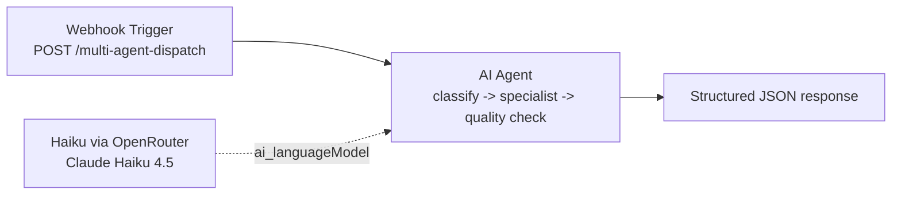

# POC-03: Multi-Agent Dispatch -> 1 AI Agent

## Overview

This POC implements the code-mode reduction of a traditional 16-node multi-agent dispatcher into a 3-node workflow. Instead of separate dispatcher, routing, specialist, fallback, and quality-check nodes, one AI Agent handles classification, specialist behavior, urgency detection, and response formatting in a single pass.

**Trigger:** Webhook `POST /multi-agent-dispatch`  
**Nodes:** Traditional `16`, code-mode `3`  
**LLM:** Claude Haiku 4.5 via OpenRouter (`anthropic/claude-haiku-4-5`)  
**Code-mode workflow:** `workflows/03-multi-agent-dispatch/workflow/workflow.ts`

## Flow



## Nodes

| Node | Type | Purpose |
|---|---|---|
| Webhook Trigger | `n8n-nodes-base.webhook` | Receives incoming customer requests over `POST /multi-agent-dispatch` |
| Haiku via OpenRouter | `@n8n/n8n-nodes-langchain.lmChatOpenAi` | Supplies the chat model used by the agent |
| AI Agent | `@n8n/n8n-nodes-langchain.agent` | Classifies the request, responds with specialist behavior, performs a quality check, and returns structured JSON |

## Traditional vs Code-Mode Architecture

The traditional WF5 design spreads the dispatch problem across 16 nodes:

- Webhook trigger
- Dispatcher classifier and parser
- Route switch
- Separate tech, sales, and FAQ specialists
- Fallback response logic
- Quality check
- Urgency filter and Telegram alert
- Final webhook response

The code-mode version keeps the same business behavior but removes the orchestration graph. The AI Agent receives the request once, decides which specialist behavior to emulate, checks response quality, flags urgency, and returns JSON in one pass. The routing logic is expressed in prompt instructions rather than switch nodes and merge nodes.

## Test

```bash
curl -X POST http://localhost:5678/webhook/multi-agent-dispatch \
  -H "Content-Type: application/json" \
  -d '{
    "message": "URGENT: Our production n8n instance is completely down and workflows are not executing. This is blocking our customer onboarding pipeline."
  }'
```

Expected output: JSON with `category`, `urgent`, `response`, and `confidence`, for example a `tech` classification with `urgent: true`.

## Benchmark

This is currently a design comparison only. We have the implemented `workflow.ts`, but no runtime benchmark yet because the workflow still needs to be pushed to n8n and measured there.

| Metric | Traditional WF5 | Code-mode WF03 | Status |
|---|---|---|---|
| Node count | 16 | 3 | Design comparison documented |
| LLM calls | 4 specialist/dispatcher calls | 1 agent call | Design comparison documented |
| Routing logic | Switch + parser + fallback + quality nodes | One AI Agent pass | Design comparison documented |
| Runtime benchmark | Not captured here | Not captured yet | Pending push and measurement |

## Install

```bash
npx n8nac push workflows/03-multi-agent-dispatch/workflow/workflow.ts
```

After pushing the workflow:

1. Open the generated workflow in n8n.
2. Configure the OpenRouter-backed credential used by `Haiku via OpenRouter`.
3. Activate the workflow.
4. Export `workflow.json` from n8n if you want the checked-in JSON snapshot to match the live workflow.

## What This Proves

- **Lifecycle layer:** Architecture -> runnable workflow definition
- **Thesis claim:** Multi-agent dispatch logic can collapse from a many-node orchestration graph into one AI Agent call without separate classifier, router, specialist, and quality-check nodes

## Status

- [x] Pattern identified from the traditional WF5 design
- [x] Traditional vs code-mode architecture documented
- [x] `workflow.ts` implemented for the 3-node code-mode workflow
- [x] `test.json` added for representative tech, sales, FAQ, and urgent cases
- [x] Benchmark section with design comparison + runtime data
- [x] Workflow pushed to n8n (`hHynFG7HpDYCYiSw`) and `workflow.json` exported
- [x] Runtime E2E: 4/4 test cases pass (avg 5.7s, ~$0.02/request with Haiku)
