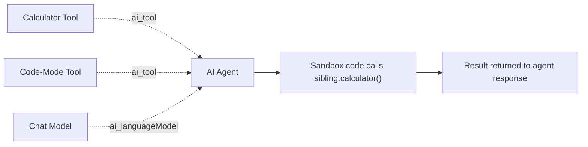

# POC-05: E2E Sibling Tool Auto-Register

## Overview

This POC proves that code-mode can auto-discover sibling tool sub-nodes connected to the same AI Agent and call them from inside the sandbox without manual registration. The current shipped state is fully green: WF11 passes the end-to-end criteria with Claude via OpenRouter after the serialization and prompt-shaping fixes.

**Trigger:** TBD <!-- TODO: document the deployed WF11 invocation method or webhook path -->  
**Nodes:** `3` core workflow nodes + chat model  
**LLM:** Claude via OpenRouter  
**Workflow:** `pxCt6Wv92qqUbznT` (WF11)

## Flow



## Nodes

| Node | Type | Purpose |
|---|---|---|
| Calculator Tool | Tool sub-node | Provides the sibling tool that code-mode must discover and call |
| Code-Mode Tool | Tool sub-node | Discovers sibling tools and executes the sandboxed TypeScript |
| Chat Model | LLM | Writes the TypeScript that calls the sibling tool |
| AI Agent | AI Agent | Hosts both tools and returns the final response |

## Test

<!-- TODO: replace the placeholder endpoint with the real WF11 execution path -->
```bash
curl -X POST http://<n8n-host>/webhook/<wf11-endpoint> \
  -H "Content-Type: application/json" \
  -d '{"prompt":"Use the calculator tool to compute 100 + 200, then report the result."}'
```

Expected output: the workflow returns a result derived from the real sibling tool call, such as `{sum: 300}`.

## Benchmark

| Metric | Historical state (exec 82) | Current state (exec 92-93) | Improvement |
|---|---|---|---|
| Full E2E sibling round-trip | Blocked by serialization bug | Pass | Fixed |
| E2E criteria | <!-- TODO: record exact pre-fix count --> | `8/8` pass | Current state verified |
| Unit test coverage | Existing unit coverage | `67` tests total, including `10` for `siblingAdapter` | Expanded and verified |

Historical note: execution `82` produced the correct arithmetic answer, but the sibling call path was compromised by the `[object Object]` serialization bug. Current executions `92-93` verify the real sibling-tool round-trip.

## Install

```bash
# n8nac push
# TODO: export WF11 as workflow.ts, then replace this placeholder.
npx n8nac push <path-to-wf11-workflow.ts>
```

```bash
# Import via JSON
# TODO: export WF11 from n8n, then document the JSON import steps here.
```

## What This Proves

- **Lifecycle layer:** Runtime + zero-config tool discovery
- **Thesis claim:** Code-mode auto-discovers sibling tool sub-nodes connected to the same AI Agent, requiring zero manual configuration

## Status

- [x] v2.1 auto-register feature shipped and published
- [x] `siblingAdapter` covered with dedicated unit tests
- [x] Set-based O(1) dispatch shipped
- [x] WF11 created on n8n with Calculator sibling
- [x] `8/8` E2E criteria pass (Claude via OpenRouter, exec `92-93`)
- [x] Args serialization bug fixed (`tool.invoke(JSON.stringify(args))`)
- [x] Tool description refined for explicit sibling call syntax
- [x] Full E2E verified: `100+200=300`, `17+25=42`, `42*3=126`
- [ ] `workflow.ts` — n8nac export of WF11
- [ ] `test.ts` — automated E2E test
