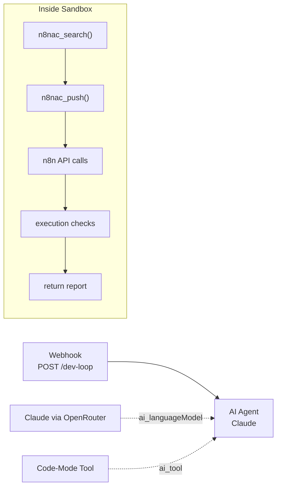

# Dev Loop — Full Lifecycle

> The capstone: n8nac CLI + n8n API as UTCP tools, so the entire dev cycle runs as one code-mode execution.

## Overview

Register n8nac CLI commands and n8n REST API endpoints as UTCP tools inside code-mode. The AI agent writes a single TypeScript block that searches for nodes, builds a workflow, pushes it to n8n, sends test payloads, and checks results — the full development loop in one sandbox execution.

**Trigger:** webhook
**Nodes:** 4 total (Webhook Trigger → AI Agent, with Chat Model + Code-Mode Tool as AI sub-nodes)
**LLM:** Claude via OpenRouter
**Category:** agents

## Flow



## Tools Registered

| Tool | Source | What It Does |
|---|---|---|
| `n8nac_*` | n8nac MCP server | Search nodes, push workflows, pull, verify, or make raw n8n API calls through the MCP server |
| `n8n` HTTP calls | n8n REST API | Call `/api/v1` endpoints directly with the `X-N8N-API-KEY` header from `{{$env.N8N_API_KEY}}` |

## The Vision

```
Traditional dev loop (6 steps, manual):
  1. npx n8nac skills search "email"     → terminal
  2. Edit workflow.ts                      → editor
  3. npx n8nac push workflow.ts           → terminal
  4. curl POST /webhook/test              → terminal
  5. bash n8n-check.sh <id>              → terminal
  6. Fix bugs, goto 2                     → manual

Code-mode dev loop (1 step, automated):
  "Build me a workflow that validates emails and sends Telegram alerts"
  → AI writes TypeScript that does steps 1-5 in one execution
```

## Test

**Endpoint:** `POST /webhook/dev-loop`

```bash
curl -X POST http://$WIN_IP:5678/webhook/dev-loop \
  -H "Content-Type: application/json" \
  -d '{"task": "Build a hello-world webhook workflow that returns {greeting: \"hello\"}"}'
```

**Expected:** AI creates, deploys, tests, and reports results for the workflow.

## Benchmark

| Metric | Manual Dev Loop | Code-Mode Dev Loop | Improvement |
|---|---|---|---|
| Steps | 6 (terminal + editor) | 1 (one prompt) | **83%** |
| Time | ~5-10 min | ~30-60 sec | **~90%** |
| Context switches | 3+ tools | 0 | **100%** |

## What This Proves

- **Lifecycle layer:** Full lifecycle (Write + Deploy + Test + Debug + Runtime)
- **Thesis claim:** The entire n8nac → n8n development cycle becomes a single code-mode execution

## Implementation Approach

**n8nac MCP server** — same pattern as our filesystem MCP server. Wraps n8nac CLI commands as MCP tools over stdio. Register as tool source in code-mode.

```json
{
  "name": "n8nac",
  "call_template_type": "mcp",
  "config": {
    "mcpServers": {
      "n8nac": {
        "transport": "stdio",
        "command": "node",
        "args": ["/home/mj/projects/n8nac-tools/dist/index.js"]
      }
    }
  }
}
```

**n8n REST API source**

```json
{
  "name": "n8n",
  "call_template_type": "http",
  "config": {
    "baseUrl": "http://172.31.224.1:5678/api/v1",
    "headers": {
      "X-N8N-API-KEY": "{{$env.N8N_API_KEY}}"
    }
  }
}
```

## Implementation Notes

- Workflow source: `workflows/agents/04-dev-loop/workflow/workflow.ts`
- JSON export: `workflows/agents/04-dev-loop/workflow/workflow.json`
- Test payloads: `workflows/agents/04-dev-loop/test.json`
- The workflow uses `responseMode: "lastNode"` so the webhook caller can receive the AI Agent's report directly.
- The task requested `@n8n/n8n-nodes-langchain.lmChatOpenAi` with an `openAiApi` credential configured for OpenRouter. Local repo notes also mention that some n8n instances work better with the dedicated `lmChatOpenRouter` node, so swap the model node type if your credential setup expects that.

## Status

- [x] Concept documented
- [x] Tool list defined
- [x] Flow diagram created
- [x] n8nac MCP server built (wraps n8nac CLI as MCP tools)
- [x] n8n REST API registered as HTTP tool source
- [x] `workflow.ts` implemented
- [x] `workflow.json` exported in repo
- [x] `test.json` populated with real webhook payloads
- [ ] End-to-end: AI builds + deploys + tests a workflow in one execution
- [ ] Benchmarked vs manual dev loop

## What's Next

1. Import or push the workflow and attach the OpenRouter-backed `openAiApi` credential in n8n
2. Run the hello-world payload from `workflows/agents/04-dev-loop/test.json`
3. Confirm the agent can search, push, execute, and report results end to end
4. Benchmark the automated loop against the manual process

---

Part of [Code-First n8n Proving Ground](https://github.com/mj-deving/code-mode)
