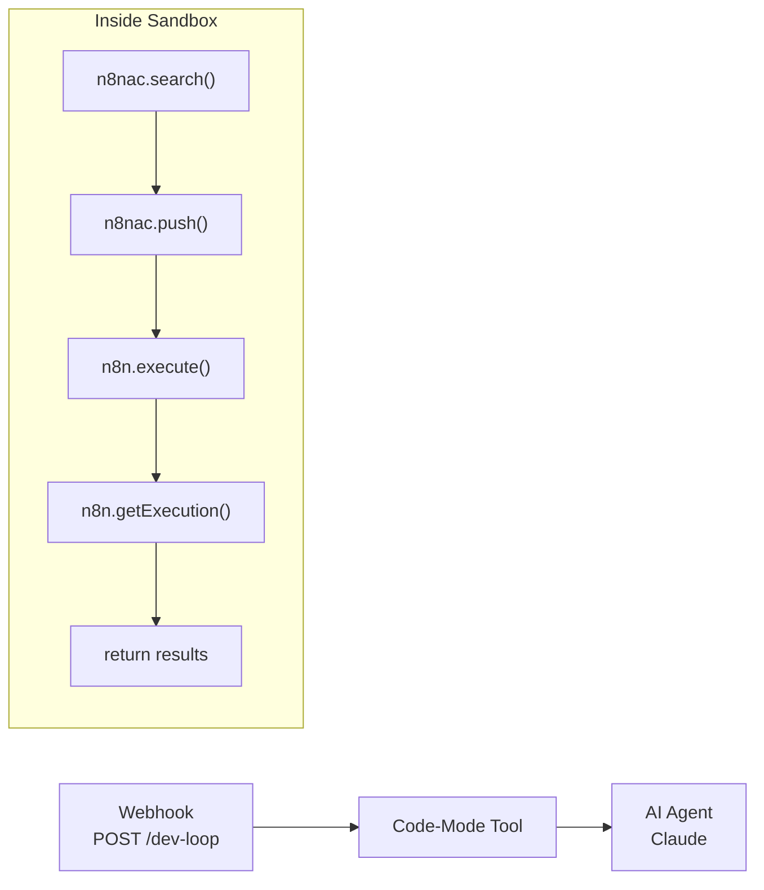

# Dev Loop — Full Lifecycle

> The capstone: n8nac CLI + n8n API as UTCP tools, so the entire dev cycle runs as one code-mode execution.

## Overview

Register n8nac CLI commands and n8n REST API endpoints as UTCP tools inside code-mode. The AI agent writes a single TypeScript block that searches for nodes, builds a workflow, pushes it to n8n, sends test payloads, and checks results — the full development loop in one sandbox execution.

**Trigger:** webhook
**Nodes:** 3 (Trigger → Code-Mode Tool → AI Agent)
**LLM:** Claude via OpenRouter
**Category:** agents

## Flow



## Tools Registered

| Tool | Source | What It Does |
|---|---|---|
| `n8nac.search` | n8nac MCP server | Search available n8n nodes by topic |
| `n8nac.push` | n8nac MCP server | Push workflow to n8n instance |
| `n8nac.validate` | n8nac MCP server | Validate workflow definition |
| `n8n.activate` | n8n REST API | Activate a workflow |
| `n8n.execute` | n8n REST API | Trigger workflow execution |
| `n8n.getExecution` | n8n REST API | Get execution result by ID |

## The Vision

```
Traditional dev loop (6 steps, manual):
  1. npx n8nac skills search "email"     → terminal
  2. Edit workflow.ts                      → editor
  3. npx n8nac push workflow.ts           → terminal
  4. curl POST /webhook/test              → terminal
  5. bash n8n-check.sh <id>              → terminal
  6. Fix bugs, goto 2                     → manual

Code-mode dev loop (1 step, automated):
  "Build me a workflow that validates emails and sends Telegram alerts"
  → AI writes TypeScript that does steps 1-5 in one execution
```

## Test

**Endpoint:** `POST /webhook/dev-loop`

```bash
curl -X POST http://$WIN_IP:5678/webhook/dev-loop \
  -H "Content-Type: application/json" \
  -d '{"task": "Build a hello-world webhook workflow that returns {greeting: \"hello\"}"}'
```

**Expected:** AI creates, deploys, tests, and reports results for the workflow.

## Benchmark

| Metric | Manual Dev Loop | Code-Mode Dev Loop | Improvement |
|---|---|---|---|
| Steps | 6 (terminal + editor) | 1 (one prompt) | **83%** |
| Time | ~5-10 min | ~30-60 sec | **~90%** |
| Context switches | 3+ tools | 0 | **100%** |

## What This Proves

- **Lifecycle layer:** Full lifecycle (Write + Deploy + Test + Debug + Runtime)
- **Thesis claim:** The entire n8nac → n8n development cycle becomes a single code-mode execution

## Implementation Approach

**n8nac MCP server** — same pattern as our filesystem MCP server. Wraps n8nac CLI commands as MCP tools over stdio. Register as tool source in code-mode.

```json
{
  "name": "n8nac",
  "call_template_type": "mcp",
  "config": {
    "mcpServers": {
      "n8nac": {
        "transport": "stdio",
        "command": "node",
        "args": ["/path/to/n8nac-mcp-server/dist/index.js"]
      }
    }
  }
}
```

## Status

- [x] Concept documented
- [x] Tool list defined
- [x] Flow diagram created
- [ ] n8nac MCP server built (wraps n8nac CLI as MCP tools)
- [ ] n8n REST API registered as HTTP tool source
- [ ] workflow.ts built on n8n
- [ ] End-to-end: AI builds + deploys + tests a workflow in one execution
- [ ] Benchmarked vs manual dev loop

## What's Next

1. Build `n8nac-mcp-server` wrapping key n8nac CLI commands
2. Register n8n REST API as HTTP tool source in code-mode
3. Build WF on n8n with both tool sources
4. Test: "Build me a hello world webhook workflow"
5. Benchmark: manual vs code-mode dev loop

---

Part of [Code-First n8n Proving Ground](https://github.com/mj-deving/code-mode)
