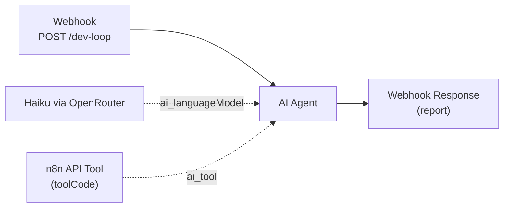

# Dev Loop — Full Lifecycle

## Overview

This workflow is the shipped full-lifecycle proof: one prompt creates, deploys, and activates another n8n workflow through the n8n REST API. The original MCP-based design was abandoned because MCP child-process spawning failed from the Windows n8n host and the `toolCode` sandbox only supports `this.helpers.httpRequest`, not `fetch` or `require`.

**Trigger:** `POST /webhook/dev-loop`  
**Nodes:** `4`  
**LLM:** `anthropic/claude-haiku-4-5` via OpenRouter  
**Workflow ID:** `EBMbixqklugU5WtQ`

## Flow



## Nodes

| Node | Type | Purpose |
|---|---|---|
| Webhook Trigger | `n8n-nodes-base.webhook` | Receives the task description at `POST /dev-loop` |
| Haiku via OpenRouter | `@n8n/n8n-nodes-langchain.lmChatOpenAi` | Provides the model using `anthropic/claude-haiku-4-5` through OpenRouter |
| n8n API Tool | `@n8n/n8n-nodes-langchain.toolCode` | Calls the n8n REST API with `this.helpers.httpRequest` |
| AI Agent | `@n8n/n8n-nodes-langchain.agent` | Orchestrates create → activate → report in one execution |

## Test

```bash
curl -X POST http://172.31.224.1:5678/webhook/dev-loop \
  -H "Content-Type: application/json" \
  -d '{"task": "Build a hello-world webhook workflow that returns {greeting: \"hello\"}"}'
```

Expected output: the agent reports that it created workflow `2sDS2zcpt78R4j2j` (`Hello World`, 2 nodes, active). The verified run completed in `11.5 sec`.

## Benchmark

| Metric | Manual Dev Loop | Dev Loop Workflow | Improvement |
|---|---|---|---|
| Steps | 6 (terminal + editor) | 1 (one prompt) | **83%** |
| Time | ~5-10 min | **11.5 sec** (Haiku) | **~97%** |
| Context switches | 3+ tools | 0 | **100%** |
| Cost per run | N/A | ~$0.05 (Haiku) | — |

Model notes:
- Claude Sonnet 4 via OpenRouter worked but cost about `$10` for `8` tool calls.
- Gemini 2.0 Flash and Gemini 2.5 Flash were not usable here because n8n received `null` tool arguments.
- Claude Haiku 4.5 via OpenRouter is the recommended default for this workflow.

## Install

```bash
# Push via n8nac
npx n8nac push workflows/agents/04-dev-loop/workflow/workflow.ts
```

```bash
# Import via JSON
# 1. Copy workflows/agents/04-dev-loop/workflow/workflow.json
# 2. In n8n UI: Workflows -> Import from File -> paste JSON
# 3. Attach OpenRouter credential to "Haiku via OpenRouter" node
# 4. Set N8N_API_KEY in the toolCode node (or via environment variable)
# 5. Activate the workflow
```

## What This Proves

- **Lifecycle layer:** Full lifecycle (write + deploy + activate + report)
- **Thesis claim:** The entire n8n development loop can collapse into one code-mode execution when the agent can call the n8n API directly from `toolCode`

## Status

- [x] Concept documented
- [x] Tool list defined
- [x] Flow diagram created
- [x] n8n API tool implemented (`toolCode` with `this.helpers.httpRequest`)
- [x] `workflow.ts` implemented
- [x] `workflow.json` exported
- [x] `test.json` populated
- [x] End-to-end: AI builds + deploys + activates a workflow in one execution
- [x] Benchmarked vs manual dev loop (`11.5 sec` vs `5-10 min`)

---

Part of [Code-First n8n Proving Ground](https://github.com/mj-deving/code-mode)
